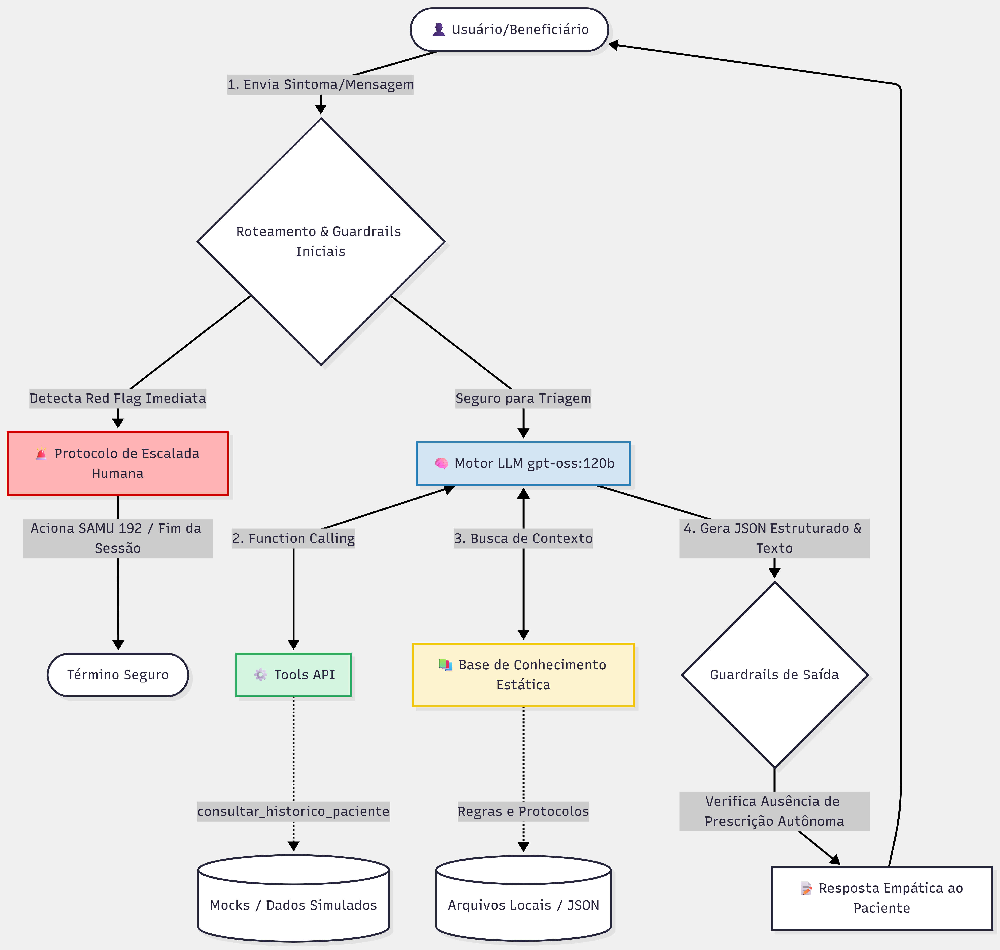

# 🏥 BluaDiagnostics - Care Plus (FIAP Challenge)

**Disciplina:** Prompt and Artificial Intelligence

**Projeto:** Agente Clínico Conversacional Seguro para o App Blua

## 👥 Integrantes
* Christian Raymundo Diaz - RM 568324
* Hanin Atwi – RM 567626 
* Giulia Martins Ferrari – RM 567574 
* Dicley Lucas Neto – RM 567588  
* Pedro Ivson Falcão de Leucas – RM 568522 

---

## 🎯 1. Persona Escolhida e Justificativa
**Persona:** Beneficiário final (usuário leigo, 25–60 anos, usando o app Blua).
**Justificativa Estratégica:** Escolhemos atuar diretamente com o paciente no momento inicial (pré-clínico), pois é a etapa de maior impacto e maior risco na jornada de saúde. 
* **O Desafio:** Este usuário possui alto risco de entrar em pânico desnecessário ou, pelo contrário, minimizar sintomas graves (ex: achar que uma dor no peito irradiada é apenas gases).
* **A Solução:** Nossa arquitetura foca em um agente com linguagem acolhedora, leiga e empática, sustentado por *guardrails* rígidos que impedem diagnósticos e forçam a escalada para pronto-socorro incondicional em caso de *Red Flags*, garantindo a segurança do paciente e otimizando o tempo do médico na etapa seguinte.

---

## ⚖️ 2. Análise Comparativa de Modelos (Stack Tecnológico)
Para a tomada de decisão do motor de Inteligência Artificial, avaliamos um modelo comercial de fronteira contra o modelo de grande porte Open-Source configurado em nossa infraestrutura através do Ollama.

| Critério Técnico | `gpt-oss:120b` (Ollama - Escolhido) | `GPT-4o-mini` (OpenAI API) |
| :--- | :--- | :--- |
| **Latência Média** | ~10 a 15 segundos (Aferido na PoC visual studio code) | ~1 a 2 segundos |
| **Custo por 1M Tokens** | **US$ 0,00** (Open-source, self-hosted) | ~US$ 0,15 (Input) / US$ 0,60 (Output) |
| **Janela de Contexto** | Alta capacidade de processamento de contexto | 128k tokens |
| **Privacidade / LGPD** | **Máxima (100% On-premise / Nuvem Privada).** Nenhum dado de saúde sai da infraestrutura da Care Plus. | Risco Moderado. Exige contratos complexos corporativos, pois os dados trafegam para servidores externos de terceiros. |

**Justificativa da Escolha (`gpt-oss:120b` via Ollama):**
Em um cenário de saúde suplementar regido pela LGPD (Dados Sensíveis), a privacidade dos dados clínicos é um pilar inegociável. Optamos pelo `gpt-oss:120b` rodando via Ollama por ser um modelo robusto de parâmetros massivos, altamente capaz de interpretar instruções complexas de triagem e estruturação de dados em JSON. Ele elimina o custo de transação por token e garante o isolamento completo do histórico clínico (comorbidades e medicações) dentro da infraestrutura própria. A latência observada atende perfeitamente a proposta de um check-up inicial assíncrono.

---

## ⚠️ 3. Riscos Clínicos Mapeados e Mitigações Específicas
Sistemas conversacionais em saúde lidam diretamente com vidas humanas. Abaixo, detalhamos os riscos inerentes à persona e as mitigações implementadas:

1. **Risco de Subtriagem em Casos Graves (Minimização):** O paciente relatar um sintoma crítico (como infarto ou AVC) e a IA prosseguir com uma triagem comum de rotina.
   * *Mitigação:* Implementação estrita e prioritária da seção `# RED FLAGS` no *System Prompt*. A IA atua como um guardrail ativo: ao detectar palavras-chave ou descrições associadas a emergências, ela interrompe imediatamente o fluxo conversacional, altera a variável `"proxima_acao": "escalada_humana"` e instrui o contato imediato com o SAMU (192) ou ida ao pronto-socorro.
2. **Risco de Prescrição Inadequada ou Exercício Ilegal da Medicina:** O modelo sugerir ou indicar dosagens de medicamentos de forma autônoma.
   * *Mitigação:* Protocolo rígido de *Human-in-the-Loop* (HITL). O prompt proíbe categoricamente qualquer tipo de conduta terapêutica direta. As interações coletadas geram apenas um relatório interno estruturado enviado ao médico, mantendo o profissional humano como único decisor e validador legal da receita.
3. **Risco de Alucinação sobre Dados do Paciente ou Interações:** O modelo inventar dados sobre o paciente ou julgar incorretamente a combinação de medicamentos.
   * *Mitigação:* Uso integrado de determinismo por meio de **Function Calling** (`consultar_historico_paciente`, `verificar_interacoes_medicamentosas`) e injeção de contexto por **RAG** baseado em bulas e protocolos de Manchester oficiais. O modelo não gera o conhecimento clínico de forma criativa, ele apenas consome dados consolidados do banco da Care Plus.

---

## 🏗️ 4. Fluxograma da Arquitetura do Sistema
O diagrama abaixo ilustra o fluxo exato da nossa Prova de Conceito (PoC), demonstrando a orquestração de chamadas de ferramentas, checagem de regras de segurança e o processamento do modelo centralizado:

