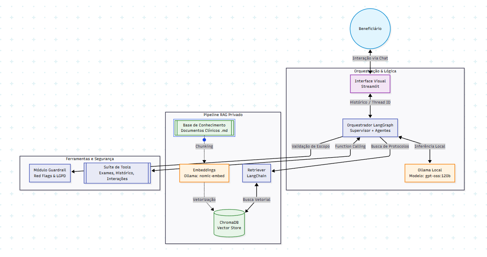

# 🩺 BluaDiagnostics - Care Plus | Sprint 4 (FIAP Challenge)

**Disciplina:** Prompt and Artificial Intelligence (2026.1)  
**Professor:** Jorge Luiz Gomes  

O **BluaDiagnostics** é um sistema conversacional avançado com Inteligência Artificial desenvolvido para o aplicativo Blua da Care Plus (grupo Bupa). Neste Sprint 2, evoluímos de um chatbot tradicional para uma **Arquitetura Multi-Agente Autônoma**, materializando o check-up digital proativo e a triagem remota segura com total conformidade à LGPD.

---

👥 Equipe

- Christian Raymundo Diaz - RM 568324
- Hanin Atwi – RM 567626
- Giulia Martins Ferrari – RM 567574
- Dicley Lucas Neto – RM 567588
- Pedro Ivson Falcão de Leucas – RM 568522

---

## 🌟 Principais Evoluções (Sprint 2)

* **Orquestração Multi-Agente (LangGraph):** Implementação de um nó Supervisor que realiza o roteamento dinâmico de contexto entre Agentes Especialistas (`Triagem`, `Prescrição` e `Escalada`), mantendo estado e memória (HITL).
* **Integração RAG Local:** Motor de busca vetorial integrado a protocolos médicos e cartilhas de saúde (ChromaDB + Embeddings Locais).
* **Suite de Tools Avançada (Function Calling):** Agentes com capacidade de tomada de decisão para invocar 5 ferramentas reais em bancos de dados simulados.
* **Segurança em 4 Níveis (Guardrails Clínicos):** Do bloqueio pré-LLM à trava visual de emergência no Streamlit.

---

## 🏗️ Arquitetura do Sistema

O sistema opera em um grafo de estados cíclico (`supervisor → [triagem | escalada | prescrição]`), permitindo que a IA acione ferramentas, analise o retorno e retome a conversa de forma autônoma.



### 🛠️ Stack Tecnológico
* **Orquestração:** LangGraph 0.2.70 / LangChain 0.3.25
* **Modelos (Local/Ollama):** `gpt-oss:120b` (idealizado) simulado via `llama3` para inferência rápida e `nomic-embed-text` para vetorização.
* **Vector Store:** ChromaDB 0.5.23
* **Frontend:** Streamlit 1.35.0
* **Qualidade e Evals:** Pytest 8.3.5 / Pydantic 2.10.6

---

## ⚙️ Ferramentas Autônomas (Function Calling)

A IA tem autonomia para cruzar dados chamando as seguintes *tools*:
1.  **`consultar_historico_paciente`**: Busca alergias, comorbidades e medicações de uso contínuo no banco de dados.
2.  **`verificar_interacoes_medicamentosas`**: Analisa o risco entre remédios atuais e novas propostas de tratamento.
3.  **`buscar_exames_paciente`**: Varre o sistema atrás de laudos laboratoriais e de imagem recentes.
4.  **`registrar_sintoma_vital`**: Estrutura sinais e dores em JSON padronizado para o prontuário.
5.  **`agendar_teleconsulta`**: Finaliza o fluxo marcando a consulta na especialidade e urgência adequadas.

---

## 🛡️ Guardrails Clínicos (Níveis de Segurança)

Para mitigar o risco de alucinações e proteger a vida do paciente, o sistema conta com:
1.  **Nível 1 (Pré-LLM):** Supervisor com validação de escopo e *Red Flags* (Custo zero de tokens).
2.  **Nível 2 (Roteamento Dinâmico):** Desvio automático para o Agente de Escalada se sintomas cardíacos ou neurológicos severos forem detectados na entrada.
3.  **Nível 3 (Prompt Engineering):** O modelo é estritamente proibido de dar diagnósticos finais e atua apenas sob protocolo *Human-in-the-Loop*.
4.  **Nível 4 (Pós-LLM no Frontend):** O Streamlit intercepta diretrizes de emergência da IA (ex: "Procure o SAMU") e trava fisicamente a interface de chat, forçando o atendimento presencial.

---

## 🚀 Como Executar o Projeto (Passo a Passo)

Para garantir a privacidade absoluta dos dados clínicos (LGPD), este projeto foi arquitetado para rodar 100% localmente (On-premise).

### Passo 1: Preparando o Ambiente Python
Clone o repositório, crie o ambiente virtual e instale as dependências:
```bash
python -m venv .venv
# Windows: .venv\Scripts\activate | Mac/Linux: source .venv/bin/activate
pip install -r requirements.txt

### Passo 2: Inicializando o Motor de IA (Ollama)
Certifique-se de ter o Ollama instalado e rodando em segundo plano. Em seguida, baixe:

# Modelo de vetorização para o RAG
ollama pull nomic-embed-text


### Passo 3: Alimentando a Base de Conhecimento (Vector Store)
Processe os protocolos médicos e cartilhas de saúde executando o script de ingestão:

python src/rag/ingest.py

### Passo 4: Rodando a Interface (Streamlit)
Com o Ollama rodando e o banco RAG populado, suba a aplicação:

streamlit run app/streamlit_app.py

O sistema abrirá automaticamente em http://localhost:8501.